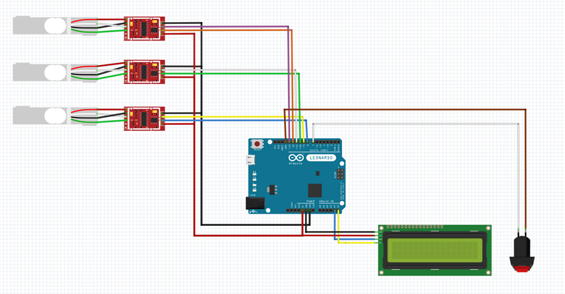

# Bancada didática de flambagem




A programação desse código foi realizada para ser aplicado em um Arduino Uno, com a utilização de três células de carga, um display e um botão. Os resultados obtidos estão programados para serem lidos em kilogramas [kg] e o botão foi desenvolido para tarar todas as células de carga.

# Dependencias

```c++
#include <HX711.h>
#include <LiquidCrystal_I2C.h>
```


# Como executar

## Clonando o repositorio
1. Clone o repositorio

```bash
git clone https://github.com/igoripc/bancada_flambagem.git
```

2. Entre no diretorio `src/`

## Configurando sistema eletrico

1. Abra o codigo `TCC_Programacao_v2.ino`

2. Altere os pinos das celulas de cargas (baseando-se no seus microcontroladores utilizados):

```c++
// Célula 01
#define pinDT_A  13
#define pinSCK_A  12

// Célula 02
#define pinDT_B  11
#define pinSCK_B  10

// Célula 03
#define pinDT_C  9
#define pinSCK_C  8
```

3. Defina o pino para o botão.
 ```c++
 #define pinBotao 7
 ```

## Configurando valor da calibragem

1. Abra o codigo  `calibragem_celula_carga.ino`

2. Defina os pinos.

```c++
#define pinDT  2
#define pinSCK  3
```

3. Execute o codigo, com a balança sem peso.

4. Apos, coloque peso.

5. Com os valores obtidos, calcule a média deles e divida pelo peso colocado.

6. O valor obtido anteriormente, sera o valor da calibração. Substitua-o na respectiva calibragem de célula de carga, no local abaixo:

```c++
scale_X.set_scale(<valor_obtido>); // Exemplo
```


# Contato
Para mais informações sobre este curso, entre em contato:


[](https://github.com/igoripc) [igoripc](https://github.com/igoripc)